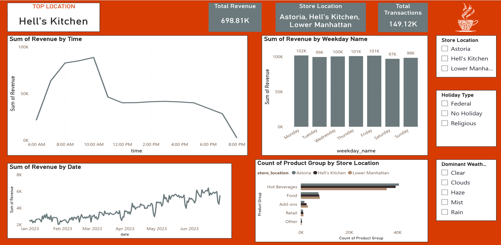
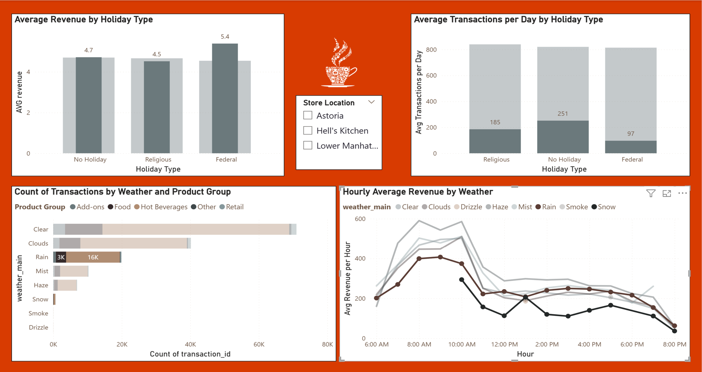
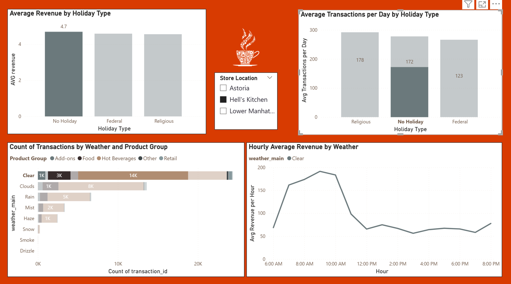
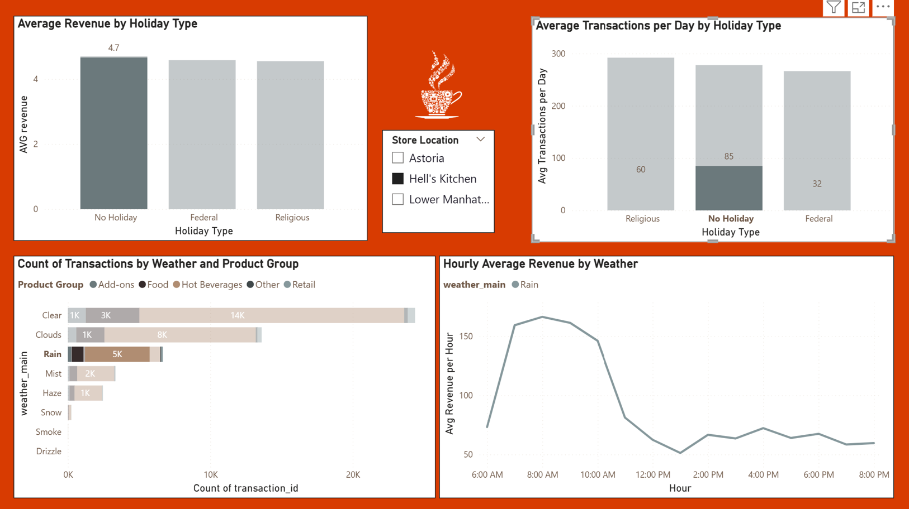

# ☕ Coffee Shop Business Analytics

## 📌 Overview
End-to-end Business Intelligence project analyzing coffee shop performance by combining transactional, calendar, and weather data at an hourly granularity.

The objective was to generate actionable insights to support operational and business decision-making.

---

## 🎯 Business Questions
- How do sales vary by time of day and day of week?
- What is the impact of weather conditions on customer behavior?
- Which product categories drive the most revenue?
- How can promotions improve performance during low-demand periods?

---

## 🧠 Data Model
- **Fact Table**: Transactions (sales, quantity, revenue)
- **Dimensions**:
  - Calendar (date, weekday, holidays)
  - Weather (temperature, conditions, precipitation)

📌 Data unified using a custom **DateTimeKey** at hourly level.

---

## ⚙️ Technical Stack
- **Power BI** → Data modeling & dashboarding  
- **Power Query** → Data cleaning & transformation  
- **DAX** → KPI calculations & measures  
- **Python (Pandas)** → Data validation & exploration  
- **Excel / CSV** → Raw data sources  

---

## 🔬 Data Validation (Python)

Before building the BI model, data validation was performed using Python (Pandas) to ensure data quality and consistency.

### ✔ Validations performed:
- Missing values analysis  
- Duplicate detection  
- Time coverage validation  
- Hourly granularity validation  
- Revenue consistency checks  
- Weather data integrity checks  

### 📂 Notebooks:
### 📂 Notebooks:

- [Transactions Exploration](notebooks/01_bi_project_transactions_exploration (1).ipynb)  
- [Calendar Exploration](notebooks/02_bi_project_calendar_exploration (1).ipynb)  
- [Weather Exploration](notebooks/03_bi_project_weather_exploration (1).ipynb)

---

## 📊 Key Insights
- ☀️ **Morning peak hours** generate the highest revenue  
- 🌧️ **Rainy days reduce transactions by up to 50%** in some locations  
- ☕ **Hot beverages account for ~77% of total sales**  
- 📍 Performance varies significantly by location (business vs tourist areas)

---

## 💡 Business Impact
- Identified optimal hours for staffing and inventory planning  
- Suggested targeted promotions during low-demand periods (e.g., rainy days)  
- Built a **simulation approach** to estimate potential revenue uplift  

---

## 📸 Dashboard Preview

### Overview Dashboard

### Weather & Holidays Impact Analysis

### ☀️ Hell's Kitchen – No Holiday / Clear Day

### 🌧️ Hell's Kitchen – No Holiday / Rainy Day

This comparison highlights how weather conditions affect customer behavior in the same location and under the same holiday context.

---

## 📁 Project Structure
- powerbi/ → Power BI dashboard (.pbix)
- notebooks/ → Python analysis
- images/ → Dashboard screenshots
- docs/ → Project documentation

---

## 🔗 Author
**Avi Kohane**  
Data Analyst | BI Enthusiast  
